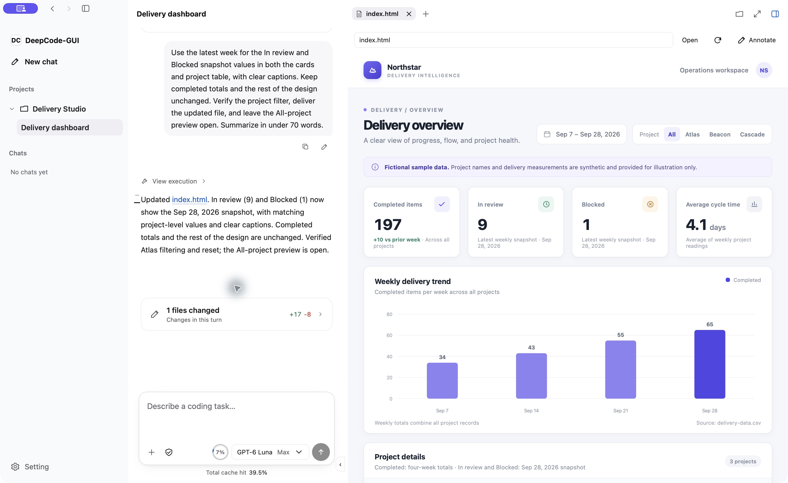
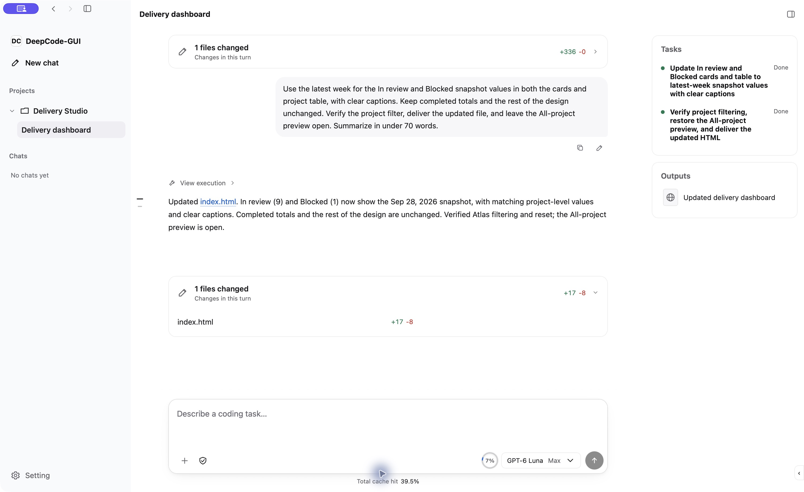

# DeepCode

### Build, inspect, and review your work in one agent workspace.

A local-first coding agent for the desktop and terminal. Work with your files, run tools, preview the result, and keep the conversation alongside it.

**[Quick start](#quick-start) · [Downloads](https://github.com/Achbite/DeepCode/releases) · [Product guide](docs/product/operations.md) · [中文](README.zh-CN.md)**



*From a CSV to an interactive dashboard in the macOS app. Real task demonstration with fictional project data.*

## One place for the whole task

| Work with your project | See what changed | Keep control |
| --- | --- | --- |
| Read code, edit files, run commands, and inspect diffs. Use the desktop GUI, CLI, or TUI with shared conversations and model connections. | Open a live browser preview, inspect the page, and ask for another revision in the same conversation. Read Markdown, HTML, images, and PDFs alongside your work. | Review proposed changes and execution requests. Choose manual or delegated approval; uncertain execution requests return to you. |

### Start with a task. Refine the result.

> Build a delivery dashboard from `delivery-data.csv`. Include four key metrics, a weekly trend, project details, and a project filter. Open a preview, check it, and deliver a self-contained HTML file.

Try it with the [sample CSV](examples/delivery-dashboard/delivery-data.csv) in your own project folder.

The Agent can read the data, propose its changes, build the page, and use the browser to check its work. Continue with feedback in the same conversation; delivered files and previews stay available in the output panel.



*An actual follow-up revision. Observation screenshots and temporary logs remain in execution history; the output panel contains results explicitly delivered for review.*

### Choose the right interface for the job

- **CLI, MCP, or GUI:** use a program's CLI when it fits, an available MCP integration for structured operations, and visual interaction when the task needs the rendered interface. The Agent can discover and activate relevant installed plugins as it works.
- **Your model connection:** configure API services or supported subscription connections. Context estimates, provider-reported token usage, and cache usage remain visible.
- **Questions without losing momentum:** the Agent can ask a clarification question and continue independent work. Your reply joins the same task; unanswered questions remain available for a decision.
- **Results you can inspect:** delivered files, live previews, and fixed-version references stay with the conversation. Markdown and HTML have a read-only preview and source view; interactive HTML opens in the browser.

The demos use the current macOS development build and fictional data. Browser inspection is available across the GUI platforms; native viewport screenshots and external desktop control currently require macOS. PDF export requires the [document runtime](skills/deepcode-documents/SKILL.md).

## Quick start

Build the current package using [Build from source](#build-from-source), or use a matching package from [Releases](https://github.com/Achbite/DeepCode/releases) when one is available. Choose an installer or a portable package:

| Platform            | Install or launch                                                                                                                       |
| ------------------- | --------------------------------------------------------------------------------------------------------------------------------------- |
| macOS Apple Silicon | Run `DeepCode-<version>-macos-arm64.pkg`, then open `/Applications/DeepCode-GUI.app`. The portable package contains `DeepCode-GUI.app`. |
| Windows x64         | Run `DeepCode-<version>-win64-setup.exe`, then open DeepCode from the Start menu. The portable package contains `DeepCode-GUI.exe`.     |
| Linux x64 / ARM64   | Extract the package for your architecture and run `./DeepCode-GUI`.                                                                     |

1. **Open DeepCode** from the installed or extracted package.
2. **Connect a model** in **Settings → Models and services**: add an API connection or sign in to a supported Coding Plan.
3. **Choose your project and describe the task.** Select a model, submit your request, and review proposed changes.

Use a project's **Manage workspace** menu to choose its folders and execution environment. Windows projects can select a local shell or WSL.

In the GUI, attach files or folders to a message, open artifacts and diffs, or ask the Agent to open an HTML preview. Browser annotations stay active until you leave with the toolbar button or Esc. New conversations inherit the last model used for a submitted task and its remembered reasoning level. Use **Cmd+Shift+R** on macOS or **Ctrl+Shift+R** elsewhere to reload the interface.

## Prefer the terminal?

The same package includes terminal interfaces:

```bash
# Linux; use DeepCode-CLI.command / DeepCode-TUI.command on macOS,
# or deepcode-cli.bat / deepcode-tui.bat on Windows.
./deepcode-cli connections
./deepcode-cli auth login openai-codex browser
./deepcode-cli ask -C /path/to/project "Explain this project"
./deepcode-tui -C /path/to/project
```

After installation with PKG or Windows Setup, use `deepcode-cli` and `deepcode-tui` directly in a terminal; on Windows, open a new terminal so it receives the updated PATH.

`-C` explicitly selects a workspace. Omit it for an independent conversation, or use `--session <id>` to continue one. Run `--help` for more commands. Connection and subscription setup is covered in [Models and services](docs/product/model-services.md).

<details>
<summary>Platform dependencies, permissions, and local data</summary>

Windows Setup installs WebView2 Evergreen Runtime if it is missing; portable Windows packages require it to be installed separately. Linux GUI requires GTK/WebKitGTK. The macOS package is ad-hoc signed; a rebuild can invalidate existing Accessibility and Screen Recording authorization even at the same app path. Verify the executing GUI with `computer.control status` after installing and authorizing the intended build. Configuration, persistent data, caches, temporary files and logs use separate platform directories. See [installation and user files](docs/distribution.md).

</details>

## Extend your workspace

Add Skills, CLI tools, MCP connections, or UI plugins. Describe the operations an integration supports so the Agent can find it by capability. Registration makes a plugin discoverable; activation loads its tools and guidance, and execution follows the configured permissions.

- [Plugin discovery and configuration](docs/product/operations.md#settings-and-extensions)
- [Computer Use: browser and desktop control](plugins/computer-use/README.md)
- [UI plugin API and example](docs/product/ui-plugins.md)
- [Models, subscriptions and usage](docs/product/model-services.md)
- [Workspace environments and permissions](docs/product/execution-environments.md)

## Under the hood

Session owns the Agent Loop and conversation state. Kernel owns tools and execution permissions. GUI, CLI, and TUI present their shared results. [Product operations](docs/product/operations.md) describes task progress, approval, context, resource delivery, and Host lifetime.

Workspace files and conversation journals are stored locally. Selected prompts, context, and images are sent to your configured model service; connected tools may also communicate with their own services. A local model connection keeps model requests on your machine.

## Build from source

Install Docker and GNU Make. On Windows, run the build commands in WSL2 with Docker integration enabled. macOS packaging additionally needs the host's Xcode Command Line Tools, Rust toolchain from `rust-toolchain.toml`, and Node.js.

The commands below build the stable release from `main`. Use `dev-main` for ongoing development.

```bash
git clone --branch main https://github.com/Achbite/DeepCode.git
cd DeepCode
make shell
```

`make shell` prepares the development container. On macOS it also starts the worktree's native build bridge. Run the desired command inside that container, or from the host while it is running:

| Target                        | Command                                   | Output                                 |
| ----------------------------- | ----------------------------------------- | -------------------------------------- |
| macOS Apple Silicon           | `bash ./build.sh --stage package-macos`   | `bin/macos-arm64/`                     |
| Windows x64                   | `bash ./build.sh --stage package-windows` | `bin/win64/`                           |
| Linux, container architecture | `bash ./build.sh --stage package-linux`   | `bin/linux-x64/` or `bin/linux-arm64/` |
| All available platforms       | `bash ./build.sh`                         | The supported directories above        |

Shared TypeScript and GUI assets, Linux binaries, and Windows cross-compilation run in Docker. macOS native compilation and signing run on the Mac host through the bridge. Unsupported platforms are reported explicitly; build failures remain failures. Each package also produces a versioned archive under `bin/`; macOS adds a PKG installer and Windows adds a Setup executable. User configuration and sessions live outside the program directory and are excluded from packages.

For a frontend-only update to an existing package:

```bash
make ui-update UI_PACKAGE=bin/macos-arm64
```

Choose `bin/win64` or the Linux package directory for those platforms. This command builds and copies the GUI bundle; run macOS resource updates on the host for signing, then reload the interface. It does not replace the running Session or Kernel. Changes to their source or bundled product guidance require a corresponding service/package build and restart. Plugin update timing is described in [product operations](docs/product/operations.md#updates).

## Development checks

Run the checks inside `make shell`:

```bash
bash ./test.sh required   # Rust formatting/tests, shared TS, GUI contracts/types, build behavior
bash ./test.sh cli        # Required checks plus the CLI → Session → Kernel path
bash ./test.sh full       # Also covers the terminal/web shells and document output
```

`bash ./test.sh static` checks shell syntax and Git whitespace and can run on the host. End-to-end scripts use a local fixture Provider; they do not replace real model or native GUI acceptance. Native GUI tests have their own Cargo workspace: `shells/deepcode-gui/src-tauri/Cargo.toml`.

## License

[MIT](LICENSE). See [attributions](ATTRIBUTION.md), [third-party notices](THIRD_PARTY_NOTICES.md), and [citation metadata](CITATION.cff).
