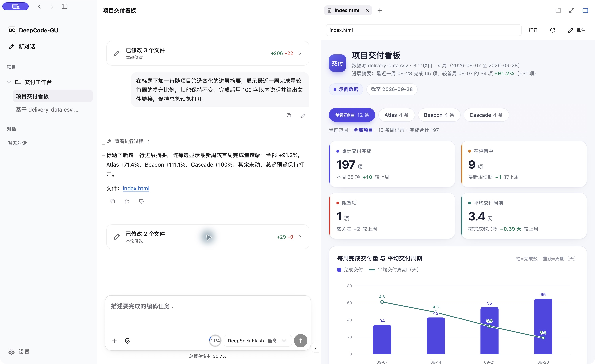
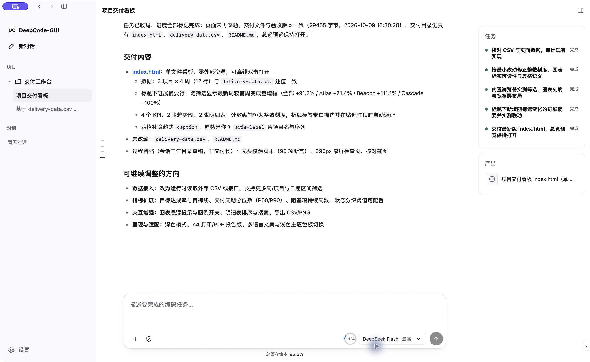

# DeepCode

### 在一个工作台里，完成代码修改、程序操作与结果审核。

优先在本机工作的编程 Agent，提供桌面和终端入口。让 Agent 处理项目文件、执行工具、打开预览，在同一对话中查看结果并继续修改。

**[快速使用](#快速使用) · [下载](https://github.com/Achbite/DeepCode/releases) · [产品指南](docs/product/operations.md) · [English](README.md)**



*在 macOS 应用中，从 CSV 生成交互式看板。真实任务演示，使用虚构的项目数据。*

## 从需求到结果，留在同一个工作台

| 处理项目 | 看到变化 | 掌握执行范围 |
| --- | --- | --- |
| 读取代码、修改文件、运行命令、检查 diff。桌面 GUI、CLI、TUI 共享对话和模型连接。 | 打开浏览器预览、检查页面，在同一对话中继续修改。并排阅读 Markdown、HTML、图片和 PDF。 | 审核修改方案与执行申请。可手动批准或委托模型审查；无法确定的执行申请交回用户决定。 |

### 描述任务，再把结果改到满意。

> 基于 `delivery-data.csv` 做一个项目交付看板，展示四个关键指标、每周趋势和项目明细，支持按项目筛选。打开预览，检查效果，交付自包含 HTML 文件。

将[示例 CSV](examples/delivery-dashboard/delivery-data.csv) 放入自己的项目文件夹，即可尝试这个任务。

Agent 可以读取数据、提出修改计划、生成页面，再通过浏览器检查结果。继续在对话中提出调整意见；交付的文件和预览保留在产出面板，方便打开和审核。



*真实的后续修改。观察截图、临时脚本和日志留在执行历史；产出面板展示明确交付给用户查看的结果。*

### 按任务选择合适的操作方式

- **CLI、MCP 与 GUI 配合使用：** 命令行适合的工作直接调用 CLI，结构化操作可使用合适的 MCP 接口，需要确认界面效果时再使用视觉交互。Agent 可按需发现并激活已登记的插件。
- **连接自己的模型服务：** 配置 API 或支持的订阅连接，查看上下文估算、Provider 返回的 Token 与缓存用量。
- **边工作边澄清：** Agent 可以先提出问题，继续不依赖答案的工作。用户回复接入同一任务，未答问题保留等待裁决。
- **审核具体结果：** 交付文件、实时预览与固定版本引用留在对话中。Markdown 和 HTML 支持只读预览及源码切换；交互式 HTML 可在浏览器中打开。

演示来自当前 macOS 开发构建，使用虚构数据。GUI 各平台支持浏览器检查；原生视口截图和外部桌面控制目前需要 macOS。PDF 导出需要配置[文档运行环境](skills/deepcode-documents/SKILL.md)。

## 快速使用

按[从源码编译](#从源码编译)生成当前程序包，也可在 [Releases](https://github.com/Achbite/DeepCode/releases) 有对应产物时下载。安装包与解压版的入口如下：

| 平台                  | 安装或启动方式                                                                                                     |
| ------------------- | ----------------------------------------------------------------------------------------------------------- |
| macOS Apple Silicon | 运行 `DeepCode-<version>-macos-arm64.pkg`，再打开 `/Applications/DeepCode-GUI.app`；解压版直接打开包内的 `DeepCode-GUI.app`。 |
| Windows x64         | 运行 `DeepCode-<version>-win64-setup.exe`，再从开始菜单打开 DeepCode；解压版打开 `DeepCode-GUI.exe`。                         |
| Linux x64 / ARM64   | 解压对应架构的程序包后运行 `./DeepCode-GUI`。                                                                             |

1. **打开 DeepCode。** 从安装入口或解压后的程序包启动。
2. **连接模型。** 在 **设置 → 模型与服务** 中添加 API 连接，或登录支持的 Coding Plan。
3. **选择项目并描述任务。** 选择模型、提交需求，审核修改方案并查看结果。

项目菜单中的 **管理工作区** 用于配置文件夹和执行环境；Windows 项目可以选择本地 Shell 或 WSL。

GUI 支持向消息附加文件或文件夹、查看产物和 diff，以及让 Agent 打开 HTML 预览。浏览器批注仅通过工具栏按钮或 Esc 退出。新对话继承上次提交任务使用的模型及该模型记住的推理强度。重载界面使用 macOS 的 **Cmd+Shift+R**，其他平台使用 **Ctrl+Shift+R**。

## 也可以在终端中使用

同一程序包也提供终端入口：

```bash
# Linux 示例；macOS 使用 DeepCode-CLI.command / DeepCode-TUI.command，
# Windows 使用 deepcode-cli.bat / deepcode-tui.bat。
./deepcode-cli connections
./deepcode-cli auth login openai-codex browser
./deepcode-cli ask -C /path/to/project "分析一下这个项目"
./deepcode-tui -C /path/to/project
```

通过 PKG 或 Windows Setup 安装后，可在终端直接使用 `deepcode-cli` 和 `deepcode-tui`；Windows 需重新打开终端以读取更新后的 PATH。

`-C` 显式选择工作目录；省略时创建独立对话，使用 `--session <id>` 可以继续已有对话。更多命令见 `--help`，连接与订阅配置见 [模型与服务](docs/product/model-services.md)。

<details>
<summary>平台依赖、权限与本地数据</summary>

Windows Setup 会在缺少 WebView2 Evergreen Runtime 时安装它，解压版需自行准备该依赖。Linux GUI 需要 GTK/WebKitGTK。macOS 程序包使用 ad-hoc 签名；即使应用路径相同，重新构建也可能使已有的辅助功能和屏幕录制授权失效。安装并授权目标构建后，应通过 `computer.control status` 核对实际 GUI 进程。配置、持久数据、缓存、临时文件和日志分别使用对应的平台目录，详见[安装与用户文件](docs/distribution.md)。

</details>

## 扩展工作台

添加 Skill、CLI 工具、MCP 连接和 UI 插件。为接入能力填写实际支持的任务与操作，帮助 Agent 按用途发现。登记使插件可被发现，激活加载工具和说明，执行仍遵循配置的权限。

- [插件发现与配置](docs/product/operations.md#settings-and-extensions)
- [Computer Use：浏览器与桌面控制](plugins/computer-use/README.md)
- [UI 插件接口与示例](docs/product/ui-plugins.md)
- [模型、订阅与用量](docs/product/model-services.md)
- [工作区环境与权限](docs/product/execution-environments.md)

## 架构与运行

Session 负责唯一的 Agent Loop 和会话状态，Kernel 负责工具与执行权限，GUI、CLI、TUI 展示共享结果。任务进度、审批、上下文、资源交付和 Host 生命周期详见[运行管理](docs/product/operations.md)。

工作区文件和会话日志存储在本机。选中的提示词、上下文和图片会发送给配置的模型服务，接入的工具也可能与各自服务通信。使用本地模型连接时，模型请求留在本机。

## 从源码编译

先安装 Docker 和 GNU Make。Windows 请在已启用 Docker 集成的 WSL2 中运行构建命令。打包 macOS 还需要宿主机的 Xcode Command Line Tools、`rust-toolchain.toml` 指定的 Rust 工具链和 Node.js。

下列命令使用 `dev-main`，对应本文展示的当前开发版本。稳定发布源码使用 `main`。

```bash
git clone --branch dev-main https://github.com/Achbite/DeepCode.git
cd DeepCode
make shell
```

`make shell` 准备开发容器；macOS 上还会启动当前 worktree 的原生构建通道。在容器中执行下列命令，或保持容器运行后从宿主机执行：

| 目标平台                | 编译命令                                      | 输出目录                                  |
| ------------------- | ----------------------------------------- | ------------------------------------- |
| macOS Apple Silicon | `bash ./build.sh --stage package-macos`   | `bin/macos-arm64/`                    |
| Windows x64         | `bash ./build.sh --stage package-windows` | `bin/win64/`                          |
| Linux，与容器架构一致       | `bash ./build.sh --stage package-linux`   | `bin/linux-x64/` 或 `bin/linux-arm64/` |
| 所有可用平台              | `bash ./build.sh`                         | 上述受支持平台的目录                            |

共享 TypeScript、GUI、Linux 程序和 Windows 交叉编译都在 Docker 中执行。macOS 原生编译与签名通过通道交给 Mac 宿主。不可用的平台会明确列出，构建错误仍会返回失败。每个平台也会在 `bin/` 生成带版本号的压缩包，macOS 另生成 PKG，Windows 另生成 Setup 安装包。用户配置和会话保存在程序目录之外，不会进入程序包。

只更新已有程序包的前端：

```bash
make ui-update UI_PACKAGE=bin/macos-arm64
```

其他平台替换为 `bin/win64` 或对应 Linux 目录。此命令构建并复制 GUI 资源；macOS 资源更新在宿主机运行以完成签名，随后重载界面。它不会替换正在运行的 Session 或 Kernel；修改这些服务的源码或内置产品说明后，需要构建对应服务或程序包并重启。插件的更新时机见[运行管理](docs/product/operations.md#updates)。

## 开发检查

在 `make shell` 中执行：

```bash
bash ./test.sh required   # Rust 格式/测试、共享 TS、GUI 合同/类型、构建行为
bash ./test.sh cli        # 另加 CLI → Session → Kernel 链路
bash ./test.sh full       # 另加终端/Web 壳及文档产出检查
```

`bash ./test.sh static` 检查 Shell 语法和 Git 空白差异，可在宿主机运行。端到端脚本使用本地 fixture Provider，不替代真实模型或原生 GUI 验收。原生 GUI 测试使用独立 Cargo workspace：`shells/deepcode-gui/src-tauri/Cargo.toml`。

## 许可证

[MIT](LICENSE)。另见 [来源说明](ATTRIBUTION.md)、[第三方声明](THIRD_PARTY_NOTICES.md) 和 [引用信息](CITATION.cff)。
