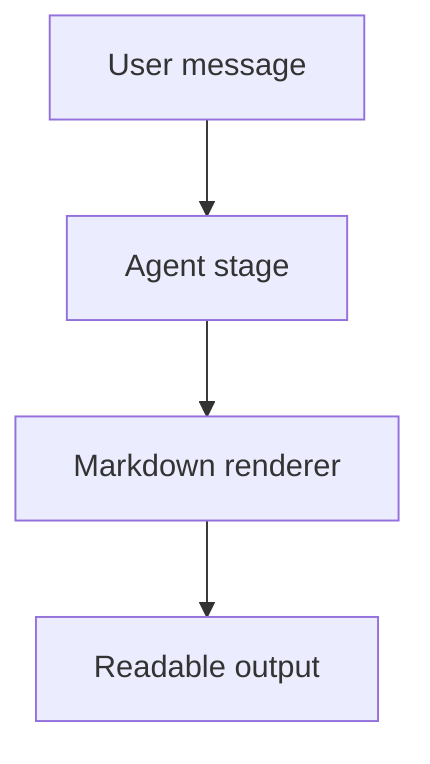

# Markdown 渲染 smoke

用于 GUI Host 人工验收 Agent 对话正文与 Agent Task 阶段面板的 GitHub Flavored Markdown、公式和 Mermaid 渲染。

| 能力 | 预期 |
| --- | --- |
| GFM table | 表格有边框和表头 |
| Checklist | checkbox 可读 |
| KaTeX inline | $E = mc^2$ |
| KaTeX block | 块级公式独立显示 |
| Mermaid | 渲染为图表 SVG |

- [x] 支持列表
- [ ] 支持未完成项

```ts
export const smoke = 'deepcode-markdown-render';
```

$$
\nabla \cdot \vec{E} = \frac{\rho}{\epsilon_0}
$$


