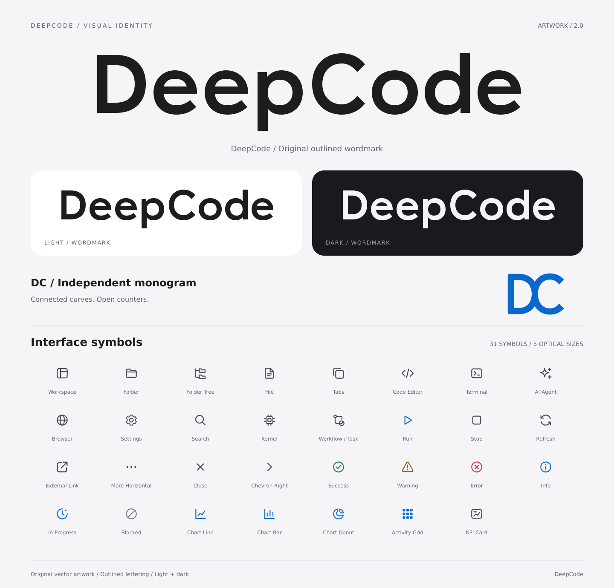

# DeepCode 品牌与界面图标

DeepCode 原创品牌标识、定制路径字标与 31 枚界面图标。设计参考 Apple Human Interface Guidelines 对简洁轮廓、视觉一致性、文字可读性和明暗环境的建议；图形与字形均为本项目原创绘制。



## 资源内容

- **主品牌标识**：完整 DeepCode 纯字标，提供浅色、深色与单色版本。
- **DC 独立图案**：左右并列的 D 与 C 通过曲线连接，使用透明背景，作为简写图案单独呈现。
- **字标**：为 DeepCode 绘制的几何字形，全部为 SVG 路径，无外部字体依赖。它是品牌字标，不是可安装的完整字体。
- **界面图标**：保留原有 31 个名称与文件路径；提供 16 / 20 / 24 / 32 / 64 px 光学尺寸。
- **主题**：currentColor、固定深色背景用色、固定浅色背景用色，以及透明 PNG。
- **预览**：本地 HTML 支持主题切换、尺寸选择、分类筛选、搜索和 SVG 下载；另有品牌、深色图标、光学尺寸三张 PNG 图板。

## 目录

```text
brand/
  masters/                 原创标记与字标母版
  svg/                     light / dark / mono 字标与 DC 图案
  png/                     透明字标与 DC 图案 PNG
sources/
  icons.json               31 枚图标的几何源、语义与小尺寸变体
  preview.html             预览页模板
scripts/generate-assets.mjs SVG、PNG、主题 token、sprite、manifest 和预览导出入口
svg/
  currentColor/            内联 SVG，随 CSS 变色
  themed/                  固定深色背景用色，保留原有路径
  themed-light/            固定浅色背景用色
  24/                      24 px currentColor 副本，保留原有路径
png/                       深色背景用色的透明 PNG
  light/                   浅色背景用色的透明 PNG
sprite/deepcode-icons.svg   24 px symbol 与必要的 16 px 精简 symbol
tokens/                    明暗主题颜色与图标尺寸类
preview/                   HTML、品牌总览、深色图标总览
docs/USAGE.md              接入、留白、尺寸、导出与设计参考
manifest.json              资源与母版索引
```

## 使用

打开 [交互预览](preview/index.html)，查看 [使用说明](docs/USAGE.md)。

内联 SVG 和 sprite 可以继承 `currentColor`。通过 `` 加载 SVG 时，外部页面的 `color` 不会传入图片，须选择对应主题的固定颜色版本：

```html


```

## 再次导出

修改母版或 `sources/`，在挂载本 worktree 的项目开发容器内运行：

```sh
node source/deepcode-ui-icon-resources/scripts/generate-assets.mjs
```

PNG 导出使用容器中的 `rsvg-convert`（Debian 包 `librsvg2-bin`）。预览图说明文字使用 `DejaVu Sans`；产品字标本身不需要字体。仅更新 SVG 与索引时可传 `--svg-only`，交付前仍须执行完整导出使 PNG 同步。不要逐个修改导出副本。

主品牌使用纯字标，DC 图案在需要简写的场景独立使用。资源的产品接入由调用方选择对应外观与尺寸。
